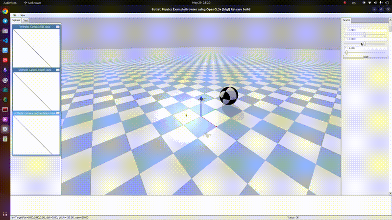
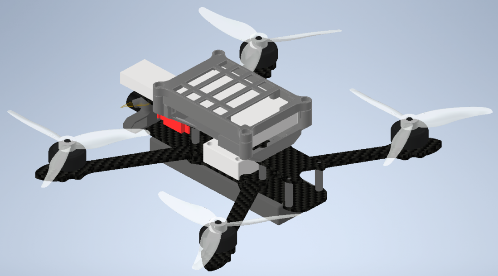
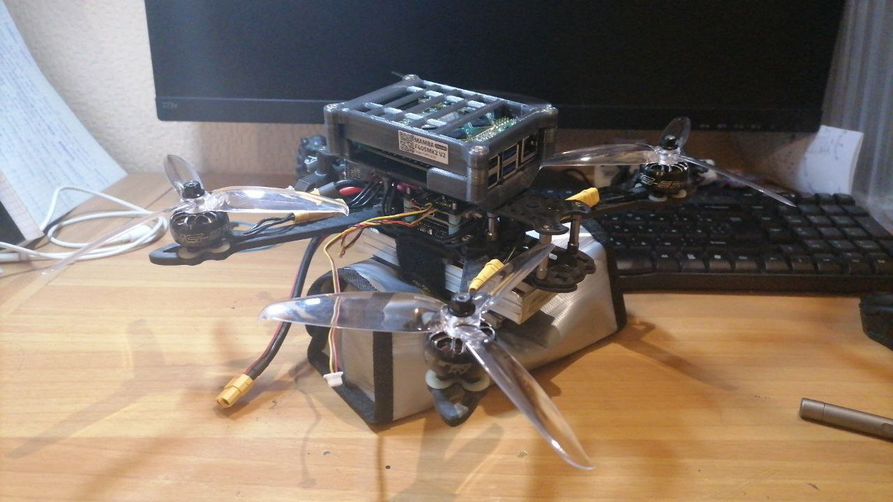

# RL_DRONE
Diploma work based on PyBullet physics simulator. Target of this work is to develop position control system using only following input data: 
- linear and angular velocity in drone local coordinates
- projected gravity [orientation analog]
- position displacement

This means drone can be operated from integrated imu data without additional velocity postprocessing from local to global coordinates

Also this work contains absolute position controllers from 
https://github.com/utiasDSL/gym-pybullet-drones.git 




## Main contributions
- **IMU Sensor model** gym_pybullet_drones/devices/sensors/imu.py
- **Physical drone model** gym_pybullet_drones/assets/custom.urdf
- **Environment for system learning** gym_pybullet_drones/envs/single_agent_rl/hover
- Sensor asynchronous clocking
Added model of physical drone 

### Drone Model
- Calculated inertia from physical analog using Autodesk Inventor
- Estimated Lift and Torque coefficients from open [database](https://database.tytorobotics.com/propellers/96z/6045-plastic), duplicated in gym_pybullet_drones/thrust_torque_estimation




### Environment
Target displacement clipped by absolute max value equal 1, so system has direction information when displacement greater than 1 and has exact measure when displacement less than 1
Sigmoid function with out scaling used to convert prediction values to range of motor speed [0, max_speed] 
Reward function motivates agent fly to center and angular rate reward penalizes keeps policy from extra rotation
```math
reward = closeness*angles \\
```
```math
closeness = \frac{||displacement||}{radius_{max}} \\
```
```math
angles = exp(||\omega||*0.1) 
```
During training drone initialized with random position from uniform distribution in sphere with radius 1.5 meters


### IMU sensor 
measurement simulation based on two-component noise model
```math
measurement(t) = estimation(t) + bias(t) + noise \\
```
```math
bias(t) =bias(t-1)+N(1,\sigma_{r}*\sqrt{dt})\\
```
```math
noise = N(1,\frac{\sigma_{d}}{\sqrt{dt}})
```


## Installation

```sh
git clone https://github.com/L-ED/RL_Drone.git
cd gym-pybullet-drones/

conda create -n drones python=3.10
conda activate drones

pip3 install --upgrade pip
pip3 install -e . # if needed, `sudo apt install build-essentials` to install `gcc` and build `pybullet`

```

## Use

### RL Position Control from local coordinates

```sh
cd gym_pybullet_drones/examples/
python hover/hover_learn_multienv.py
```

### PID position control example 

```sh
cd gym_pybullet_drones/examples/
python3 pid.py
```

### Stable-baselines3 PPO RL example

```sh
cd gym_pybullet_drones/examples/
python3 learn.py
```